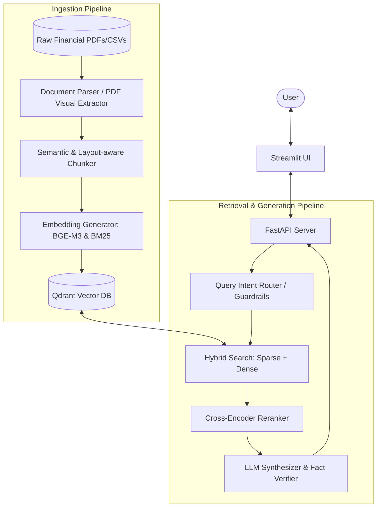
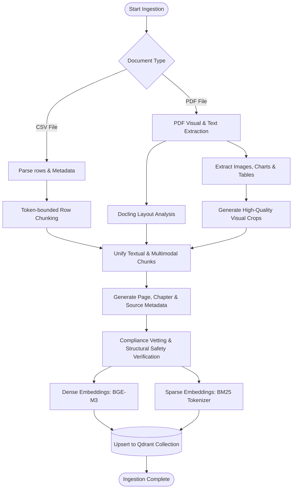
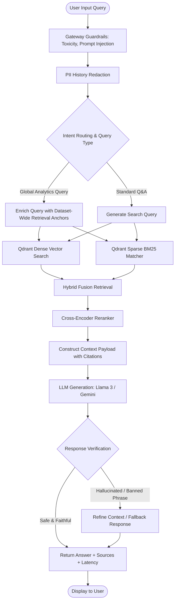

# Multimodal Agentic RAG

An agentic, multi-modal RAG architecture built to extract, reason over, and retrieve unstructured document text, tabular CSV data, and visual charts.

### Key Capabilities

- Agentic Routing: Powered by Pydantic-AI to dynamically orchestrate queries across Qdrant vector search, pandas dataframe execution, and OpenRouter Gemini Vision.
- Visual Grounding: Features a dynamic path-resolution registry to map document figures directly to original raw crop images and bounding boxes.
- 13-Layer Guardrail Safety: Built-in validation gauntlet covering path safety, quote anchoring, rate limits, and faithfulness with automated Self-RAG loops.
- Interactive UI: Streamlit interface rendering grounded citations, Markdown tables, and exact visual assets inline.

### Tech Stack & System Architecture

Frontend & Presentation
- Streamlit : Interactive chat UI, dynamic source citations, extracted Markdown tables, and visual chart rendering

Core Agent Framework
- Pydantic-AI: Agent reasoning, tool calling, structured BaseModel output validation, and self-correction loops

Models & Orchestration
- Groq / NVIDIA NIM API: High-speed LLM reasoning engine for text-based synthesis
- Google Gemini 2.5 Flash (via OpenRouter): Vision-Language Model (VLM) for high-fidelity OCR, table parsing, and visual image analysis

Storage & Retrieval
- Qdrant: Vector database for document indexing and hybrid semantic/keyword search
- Pandas: Dynamic query execution engine for structured CSV data, math, and filtering

Embeddings & Reranking
- Sentence-Transformers: Dense vector embedding generation
- Cross-Encoder Rerankers: Top-K chunk relevance optimization before LLM generation

Security, Safety & Guardrails
- Custom RAGMasterSafetyGauntlet: 13-layer safety engine for PII redaction, prompt injection defense, rate limiting, path safety, quote anchoring, and faithfulness evaluation

Observability & Tracing
- Langfuse: Real-time execution tracing, latency tracking, token usage, and safety scoring
- OpenTelemetry: Standardized agent execution logging and telemetry

# Architecture & Workflow

This document provides a comprehensive breakdown of the system architecture, core components, and step-by-step query execution workflow for the Multimodal Agentic RAG system.

---

## Overview

The system utilizes a decoupled, high-throughput architecture featuring a **Streamlit** frontend communicating directly with an Agentic Orchestrator built on **Pydantic-AI**. 
 The system is split into two primary pipelines:
1. **Ingestion Pipeline**: Processes raw PDFs, CSVs, and documents, chunks them, computes embeddings, and stores them in **Qdrant**.
2. **Query & Inference Pipeline**: Takes a user query, applies guardrails, retrieves candidate documents via hybrid search, reranks, synthesizes the answer, verifies safety/fidelity, and serves it back to the client.
   


---

## 2. Deep Dive: Ingestion Pipeline

The ingestion pipeline is designed to handle multimodal and structured documents (PDFs, CSVs) to extract textual and visual elements (tables, charts, figures) accurately.



- **Visual Extraction**: Uses [pdf_visual_extraction.py](file:///C:/Users/supri/recovered-rag-project/app/pdf_visual_extraction.py) to isolate visual elements and crops.
- **Data Ingestion Script**: Managed by [ingest_data.py](file:///C:/Users/supri/recovered-rag-project/ingest_data.py) and deployment scripts like [deploy_to_qdrant.py](file:///C:/Users/supri/recovered-rag-project/deploy_to_qdrant.py).

---

## 3. Deep Dive: Query & Retrieval Pipeline

When a user submits a query through [StreamlitApp.py](file:///C:/Users/supri/recovered-rag-project/streamlit_ui/StreamlitApp.py), it is sent to the FastAPI backend [main.py](file:///C:/Users/supri/recovered-rag-project/app/main.py) and executed via [query_rag.py](file:///C:/Users/supri/recovered-rag-project/query_rag.py).



- **Guardrails**: Input and gateway guardrails are processed via [gateway_guardrails.py](file:///C:/Users/supri/recovered-rag-project/gateway_guardrails.py) and safety filters in [compliance_safety.py](file:///C:/Users/supri/recovered-rag-project/compliance_safety.py).
- **Retrieval & Reranking**: Conducted by [retriever.py](file:///C:/Users/supri/recovered-rag-project/app/retriever.py) and [reranker.py](file:///C:/Users/supri/recovered-rag-project/app/reranker.py).
- **Generation & Fallbacks**: Synthesized in [query_rag.py](file:///C:/Users/supri/recovered-rag-project/query_rag.py) with [llamaindex_brain.py](file:///C:/Users/supri/recovered-rag-project/app/llamaindex_brain.py).

```
---

## 2. Key Components

### 🖥️ A. Frontend: Streamlit Application
* *Primary Role:* Manages UI rendering, voice input processing, active chatbot session management, and chat history persistence.
* *display_image_robustly Helper:* A specialized utility that handles cross-platform path translation (Windows vs. Linux), filters out broken Git LFS pointer files (<1 KB), and dynamically loads visual assets from either root or mount directories.

### 🧠 B. Brain: Pydantic-AI Orchestrator
* *Primary Role:* Functions as the central routing and decision engine.
* *Model Integration Strategy:*
  * *Groq / NVIDIA APIs:* Utilized for rapid text reasoning, logic evaluation, and route classification.
  * *OpenRouter (Gemini 2.5 Flash):* Leveraged specifically for multimodal vision processing, diagram understanding, and extracting structured data points from visual figures.
* *Autonomous Routing:* Uses dynamic tool call schemas to inspect data structures on the fly, avoiding rigid heuristics.

### 📁 C. Indexing & Registries (Craft ID Mapping)
* *Multimodal Asset Registry & Craft ID Mapping:* A compiled Python catalog linking raw files, figures, tables, page numbers, and unique *Craft IDs / Entity IDs* directly to their absolute disk paths.
  * *Craft ID Cataloging:* Assigns deterministic entity identifiers (Craft IDs) to every extracted visual element, chart, and structured table during ingestion.
  * *Deterministic Mapping:* Ensures the orchestrator can perform fast, direct lookups by Craft ID rather than relying solely on fuzzy semantic searches, guaranteeing exact asset retrieval.
* *Vector Store:* Qdrant indexing standard text pages embedded using sentence-transformers.
* *Tabular Index:* Pre-loaded Pandas DataFrames representing structured document tables for exact, programmatic data manipulation.

### 🛡️ D. Security: 13-Layer Safety Gauntlet
An invariant safety pipeline executing strict sequential checks prior to payload dispatch:
* *Core Layers:* PII Redaction, Prompt Injection Scans, Craft ID / Path Verification, Bounding Box Region Alignment, Exact Quote Anchoring, and Faithfulness Evaluations.

---

## 3. Query Execution Lifecycle

### Step 1: Input Validation & Rate Limiting
* Scans incoming user queries for active prompt injections and sensitive PII leak vectors.
* Evaluates sliding-window rate limits (REQUEST_CAP = 5 requests per WINDOW_SECONDS = 60).

### Step 2: Intent Classification & Search Routing
The agent analyzes query semantics and dispatches execution to one of three optimal pathways:
* *Pathway A (Tabular):* Routed to Pandas for data aggregations, dynamic mathematical computations, and direct dataframe filtering.
* *Pathway B (Textual):* Routed to Qdrant vector search for semantic chunk retrieval, followed by a Transformer-based cross-encoder reranking pass.
* *Pathway C (Visual & Entity Lookups):* Triggered when a query references a figure, image, chart, or explicit Craft ID. Looks up the precise Craft ID in the registry and employs Annotated type definitions to compel the Gemini Vision model to output structured Markdown table representations of visual charts.

### Step 3: Self-Correction & Table Recovery Loop
* If a visual query fails or yields an empty table payload, the orchestrator intercepts the raw vision output.
* A programmatic fallback parser extracts Markdown table rows (|) directly from the model's intermediate reasoning string and injects them back into the structured response payload.

### Step 4: Output Guardrails & Safety Vetting
* *Path & Craft ID Alignment:* Verifies that any referenced visual asset matches its registered Craft ID, exists in the asset registry, and points to a valid binary image (filtering Git LFS pointers).
* *Bounding Box Matching:* Confirms extracted chart data boundaries map precisely back to source document page coordinates using entity metadata.
* *Faithfulness Evaluation:* Computes semantic similarity scores against retrieved context chunks to detect and eliminate hallucinations.

### Step 5: Frontend Rendering
* *Text Synthesis:* Streamlit renders the validated reasoning stream.
* *Tabular Data:* Reconstructs raw tabular outputs into clean interactive UI tables.
* *Visual Data:* Displays high-resolution binary image assets mapped directly from the Craft ID registry.
---

# Live Demo

🔗 **Streamlit App:**  
https:/rag-system-v2.streamlit.app

---

Endpoint:

```
POST /query
```


# Project Structure

```

    recovered-rag-project/
    │
    ├── .agents/                          # Customization configurations (hooks, config configs)
    │
    ├── app/                              # Core application backend
    │   ├── __init__.py
    │   ├── conversation_manager.py       # Manages session history and chat message memory
    │   ├── embeddings.py                 # Generates dense text vector embeddings
    │   ├── main.py                       # FastAPI server setup and core business logic
    │   ├── multimodal_assets.py          # Multimodal asset registry scanner and mapping logic
    │   └── reranker.py                   # Reranking layer utilizing transformers models
    │
    ├── assets/                           # Source document extract folders
    │   ├── extracted_images/             # Page images and visual charts (including LFS files)
    │   └── extracted_tables/             # Extracted tables formatted as raw CSV files
    │
    ├── extracted_images/                 # Real binary visual images folder (targets for resolution)
    │
    ├── multimodal-rag-system/            # Helper modules
    │   └── schemas_and_agent.py          # Pydantic schema configurations and tool schemas
    │
    ├── streamlit_ui/                     # Streamlit frontend app
    │   └── StreamlitApp.py               # Main UI rendering engine and validation controller
    │
    ├── tests/                            # Validation tests
    │   ├── __init__.py
    │   └── test_guardrail_eval.py        # System testing suite for gauntlet evaluations
    │
    ├── compliance_safety.py              # Decoupled 13-Layer safety gauntlet validation pipeline
    ├── gateway_guardrails.py             # Wallet protection, rate limiting, and PII gateway logic
    ├── pytest.ini                        # Pytest config options
    ├── requirements.txt                  # Python dependency list
    └── .env                              # Environment api keys (Groq, OpenRouter, Langfuse)
```

---

## 🛠️ Local Setup & Installation

### 1. Repository & Git LFS Setup
```bash
git clone [https://github.com/your-username/rag-system-v2.git](https://github.com/your-username/rag-system-v2.git)
cd rag-system-v2
git lfs install && git lfs pull
### Run FastAPI Server
uvicorn app.main:app --reload
```
### 2. Virtual Environment & Dependencies
python -m venv venv
.\venv\Scripts\activate  # Windows (or: source venv/bin/activate on Mac/Linux)
pip install --upgrade pip && pip install -r requirements.txt

### 3. Environment Variables (⁠.env⁠)
GROQ_API_KEY=your_groq_api_key
OPENROUTER_API_KEY=your_openrouter_api_key
- Optional Logging
LANGFUSE_PUBLIC_KEY=your_langfuse_public_key
LANGFUSE_SECRET_KEY=your_langfuse_secret_key
LANGFUSE_HOST=[https://cloud.langfuse.com](https://cloud.langfuse.com)

### 4. Run Services & Launch App
- Start Qdrant Vector Store (Docker)
docker run -d -p 6333:6333 -p 6334:6334 -v qdrant_storage:/qdrant/storage qdrant/qdrant
- Run Gauntlet Tests
pytest -v
- Launch Streamlit Interface
streamlit run streamlit_ui/StreamlitApp.py


---

# Deployment
Deploy to Streamlit Cloud


# Future Improvements

  ### 1. Vector Database Hybrid Search Upgrade
  Implement Sparse-Dense Hybrid Search in Qdrant (combining BM25 keyword matching with dense vectors) to improve document search precision,
  especially for specific section codes and numeric figures.

  ### 2. LLM Reranking Optimization
  Migrate to a hosted cloud reranking endpoint (like Cohere Rerank API or BGE-Reranker-Large). This will significantly reduce local latency
  and improve the accuracy of top retrieval contexts.

  ### 3. Dynamic Bounding Box Layout Parsing
  Integrate a layout-aware PDF parser like PyMuPDF / LayoutParser or Gemini Document Parsing to detect chart coordinates dynamically on-
  the-fly, allowing the system to handle any raw PDF without pre-cropped coordinates.

  ### 4. Semantic Caching Layer
  Introduce a semantic cache (e.g., using GPTCache or a Qdrant semantic matching index) to capture repeated or highly similar user queries,
  returning the cached response in milliseconds without hit costs.

  ### 5. Multi-Agent Collaboration Topology
   Upgrade to a hierarchical team of agents:
      • Research Agent: Specializes in retrieving text and cross-referencing.
      • Vision Agent: Specialized in reading complex chart layouts.
      • Validator Agent: Operates as a compiler to cross-check outputs before UI delivery.

# Example Questions

- How must suspicious transactions be reported?
- What penalties apply for delayed reporting?
- Under which rule should suspicious transactions be reported to FIU-IND?

---

# Author

**Supriya**  
AI / ML Engineer | Generative AI
