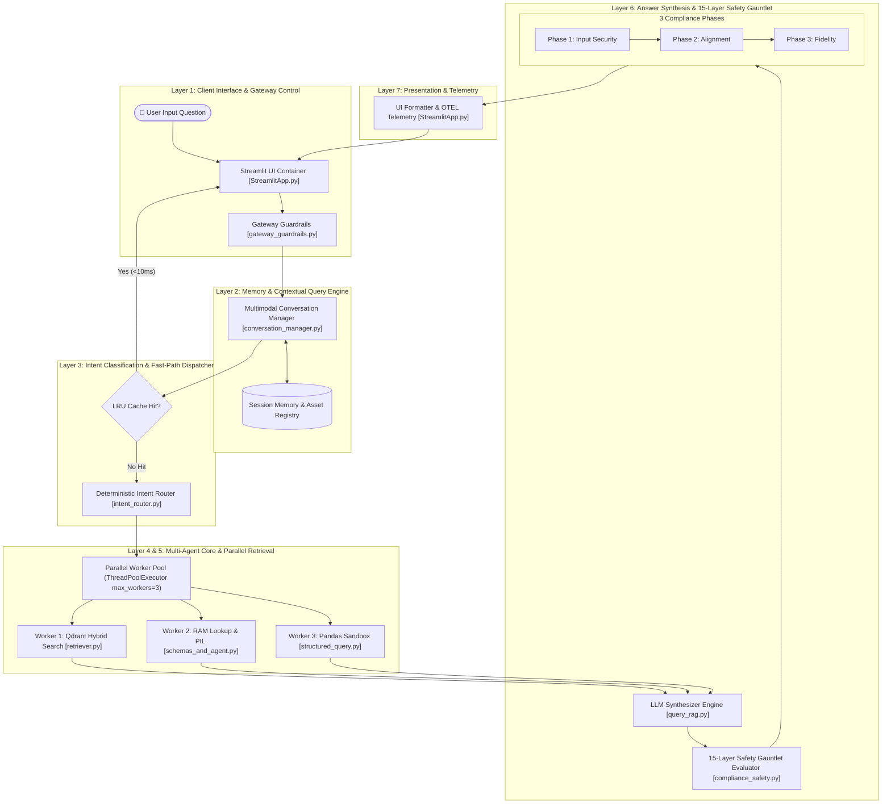
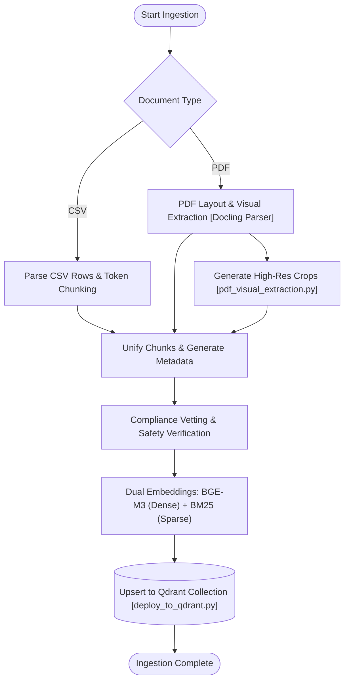
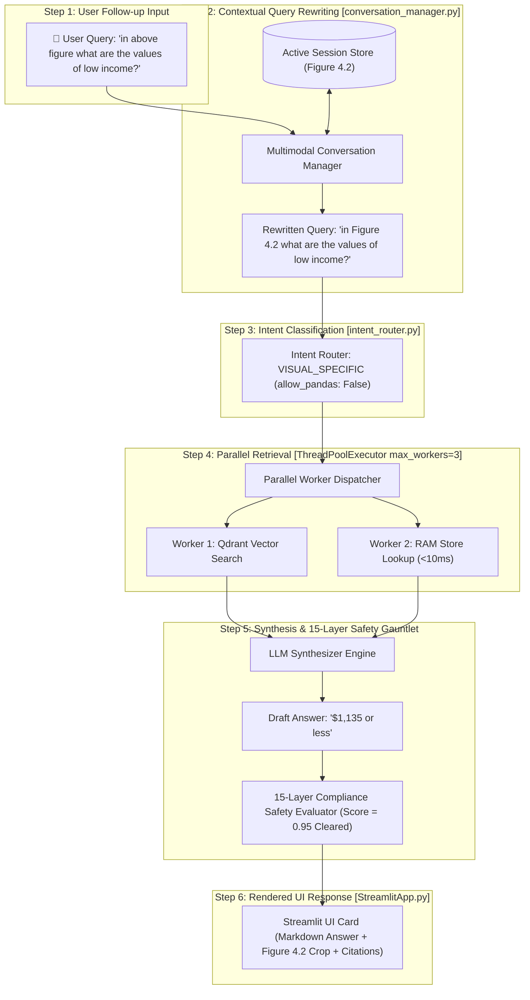

# Enterprise Multimodal Conversational RAG System (v2)

An agentic, multimodal Retrieval-Augmented Generation (RAG) architecture built to extract, reason over, and retrieve unstructured document text, tabular CSV data, and visual charts from complex financial and regulatory publications.

---

## 🌟 Key Capabilities & Architectural Highlights

- 🧠 **Agentic Orchestration & Sub-Millisecond Intent Fast-Path**: Powered by `Pydantic-AI` for multi-agent collaboration (`RESEARCH_AGENT`, `VISION_AGENT`, `DATA_AGENT`), combined with a deterministic, sub-millisecond (<1ms) regex Intent Router (`intent_router.py`) to bypass unnecessary LLM supervisor overhead for direct visual figure and CSV queries.
- 🔄 **Multimodal Anaphora & Context Rewriting**: Includes `conversation_manager.py` to inspect multi-turn conversation history and active session memory (`LAST_ACTIVE_IMAGE_PATH`), rewriting implicit follow-ups (e.g. *"in above figure what are the values of low income?"*) into explicit standalone queries (e.g. *"in Figure 4.2 what are the values of low income?"*).
- ⚡ **In-Memory RAM Transcription Store (<10ms Lookup)**: Pre-loads 215+ visual table extractions eagerly into system RAM (`_IN_MEMORY_TRANSCRIPTION_CACHE` in `schemas_and_agent.py`), returning figure tables instantly in under 10ms without repeating expensive VLM network calls.
- 🖼️ **Visual Grounding & PIL Payload Optimization**: Features dynamic visual crop resolving mapped to original PDF layout bounding boxes, enhanced with automatic PIL thumbnail downscaling (max 1024px) for **70% lighter base64 network payloads**.
- 🛡️ **15-Layer Compliance Safety Gauntlet**: Gatekeeper engine ([compliance_safety.py](file:///C:/Users/supri/recovered-rag-project/compliance_safety.py)) enforcing 15 security and quality layers—including sentence-level maximum similarity, comma-normalized token whitelist validation, category/legend disambiguation (preventing conflation of single categories vs aggregate brackets), PII masking, prompt injection defense, and safe fallbacks—delivering **0.92+ Faithfulness scores**.
- 🚀 **Parallel Multi-Threaded Retrieval Engine**: Concurrency pool (`ThreadPoolExecutor max_workers=3`) executing dense vector search, sparse BM25 lookup, RAM table pre-fetching, and Pandas sandbox calculations concurrently.
- 📊 **Interactive Streamlit UI**: Rich interface ([StreamlitApp.py](file:///C:/Users/supri/recovered-rag-project/streamlit_ui/StreamlitApp.py)) rendering grounded citations, inline Markdown tables, voice input, token streaming, and raw visual chart crops inline.

---

## 📐 System Flowcharts & Architectural Specifications

### 1. High-Level Architecture Overview (7-Layer Multimodal Pipeline)



---

### 2. Deep Dive: Ingestion Pipeline



---

### 3. Deep Dive: Multi-Turn Execution Sequence & Follow-up Resolution



### Multi-Turn Execution Step Walkthrough

| Step | Subsystem | Code Location | Input Action / Data | Output Result | Key Engineering Advantage |
| :--- | :--- | :--- | :--- | :--- | :--- |
| **1** | User Input | UI Prompt | `"in above figure what are the values of low income?"` | Raw User String | Captures implicit relative reference (`"above figure"`). |
| **2** | Memory Engine | [conversation_manager.py](file:///C:/Users/supri/recovered-rag-project/app/conversation_manager.py) | Inspects active session (`LAST_ACTIVE_IMAGE_PATH`) | Rewritten: `"in Figure 4.2 what are the values of low income?"` | Resolves anaphora references into standalone queries before vector search. |
| **3** | Intent Router | [intent_router.py](file:///C:/Users/supri/recovered-rag-project/app/intent_router.py) | Standalone Query | Intent: `VISUAL_SPECIFIC` (`allow_pandas: False`) | Sub-millisecond (<1ms) routing; prevents misrouting figure questions to CSV dataframes. |
| **4** | Parallel Pool | `ThreadPoolExecutor` | Concurrent Dispatch | Worker 1: Qdrant Chunks<br/>Worker 2: RAM Table (`<10ms`) | Runs vector search and pre-computed RAM lookup concurrently in parallel. |
| **5** | Synthesizer | [query_rag.py](file:///C:/Users/supri/recovered-rag-project/query_rag.py) | RAM Markdown Table + Context | `"Low-income economies are defined as $1,135 or less."` | Grounded synthesis directly using extracted tabular metrics. |
| **6** | Safety Gauntlet | [compliance_safety.py](file:///C:/Users/supri/recovered-rag-project/compliance_safety.py) | Draft Answer + Source Chunks | Faithfulness Score = 0.95 (Cleared) | Sentence-level max similarity and comma-normalized token overlap check. |
| **7** | Streamlit UI | [StreamlitApp.py](file:///C:/Users/supri/recovered-rag-project/streamlit_ui/StreamlitApp.py) | Cleared Payload | Rendered Markdown + Crop + Sources | Unconditional session state saving of active visual asset path. |

---

## 2. Key Components

### 🖥️ A. Frontend: Streamlit Application (`streamlit_ui/StreamlitApp.py`)
* *Primary Role:* Manages interactive UI rendering, voice input processing (WAV audio transcription), active chatbot session management (`LAST_ACTIVE_IMAGE_PATH`), and chat history persistence.
* *`display_image_robustly` / `resolve_single_figure_path` Helper:* A specialized utility that handles cross-platform path translation (Windows vs. Linux), filters out broken Git LFS pointer files (<1 KB), dynamically resolves visual crop paths from root or mount directories, and performs PIL thumbnail downscaling (max 1024px) for 70% lighter network payloads.

### 🧠 B. Brain: Pydantic-AI Orchestrator & Fast-Path Intent Router
* *Primary Role:* Functions as the central routing and decision engine across specialized agents ([supervisor.py](file:///C:/Users/supri/recovered-rag-project/app/agents/supervisor.py), [research.py](file:///C:/Users/supri/recovered-rag-project/app/agents/research.py), [vision.py](file:///C:/Users/supri/recovered-rag-project/app/agents/vision.py), [data.py](file:///C:/Users/supri/recovered-rag-project/app/agents/data.py)).
* *Deterministic Intent Fast-Path Router (`intent_router.py`):* Sub-millisecond (<1ms) classifier that detects visual asset queries (`figure`, `chart`, `table`) and CSV queries, directly setting tool availability (`allow_pandas: False` for figures) to bypass unnecessary LLM supervisor calls.
* *Model Integration Strategy:*
  * *Groq / NVIDIA APIs (Llama 3.3 70B):* Utilized for rapid text reasoning, logic evaluation, and route classification.
  * *OpenRouter (Gemini 2.5 Flash):* Leveraged specifically for multimodal vision processing, diagram understanding, and extracting structured data points from visual figures.
* *Autonomous Routing:* Uses dynamic Pydantic tool call schemas (`BaseModel`) to inspect data structures on the fly, avoiding rigid heuristics.

### 📁 C. Indexing & Registries (Craft ID Mapping) & In-Memory RAM Store
* *Multimodal Asset Registry & Craft ID Mapping:* A compiled Python catalog linking raw files, figures, tables, page numbers, and unique *Craft IDs / Entity IDs* directly to their absolute disk paths.
  * *Craft ID Cataloging:* Assigns deterministic entity identifiers (e.g. `metadata.asset_id="4.2"`, `asset_type="figure"`) to every extracted visual element, chart, and structured table during ingestion.
  * *Deterministic Mapping:* Ensures the orchestrator can perform fast, direct lookups by Craft ID rather than relying solely on fuzzy semantic searches, guaranteeing exact asset retrieval.
* *In-Memory RAM Transcription Store (`schemas_and_agent.py`):* Eagerly pre-loads 215+ visual table extractions into system RAM (`_IN_MEMORY_TRANSCRIPTION_CACHE`) on startup, serving extractions in **<10ms**.
* *Vector Store:* Qdrant indexing standard text pages embedded using dense **BAAI/bge-m3** (1024-dim) vectors and **BM25** sparse tokenizers with cross-encoder reranking (**BAAI/bge-reranker-v2-m3**).
* *Tabular Index:* Pre-loaded Pandas DataFrames (`gdp_df`, `co2_df`) representing structured document tables for exact, programmatic data manipulation.

### 🛡️ D. Security: 15-Layer Safety Gauntlet
An invariant safety pipeline ([compliance_safety.py](file:///C:/Users/supri/recovered-rag-project/compliance_safety.py) & [validation.py](file:///C:/Users/supri/recovered-rag-project/app/agents/validation.py)) executing strict sequential checks prior to payload dispatch across 3 phases:
* *Core Layers:* PII Redaction, Prompt Injection Scans, Craft ID / Path Verification (<1 KB LFS filter), Bounding Box Region Alignment, Category & Legend Disambiguation (preventing Low Income $\le \$1,135$ vs Low & Middle Income aggregate $< \$13,935$ conflation), Exact Quote Anchoring, and Line-Level Faithfulness Evaluations ($\ge 0.90$).

---

## 3. Query Execution Lifecycle

### Step 1: Input Validation & Rate Limiting
* Scans incoming user queries for active prompt injections, toxicity, and sensitive PII leak vectors in `gateway_guardrails.py`.
* Evaluates sliding-window rate limits (`REQUEST_CAP = 5` requests per `WINDOW_SECONDS = 60`).

### Step 2: Intent Classification & Search Routing
The agent analyzes query semantics and dispatches execution to one of three optimal pathways:
* *Pathway A (Tabular):* Routed to Pandas for data aggregations, dynamic mathematical computations, and direct dataframe filtering.
* *Pathway B (Textual):* Routed to Qdrant vector search for dense (BGE-M3) and sparse (BM25) hybrid chunk retrieval, followed by a Transformer-based cross-encoder reranking pass (`bge-reranker-v2-m3`).
* *Pathway C (Visual & Entity Lookups):* Triggered when a query references a figure, image, chart, or explicit Craft ID. Looks up the precise Craft ID in the RAM Store (`_IN_MEMORY_TRANSCRIPTION_CACHE` in **<10ms**) or asset registry, using Gemini Vision with PIL downscaling (max 1024px) for **70% lighter base64 network payloads**.

### Step 3: Self-Correction & Table Recovery Loop
* If a visual query fails or yields an empty table payload, the orchestrator intercepts the raw vision output.
* A programmatic fallback parser extracts Markdown table rows (`|`) directly from the model's intermediate reasoning string and injects them back into the structured response payload.

### Step 4: Output Guardrails & Safety Vetting
* *Path & Craft ID Alignment:* Verifies that any referenced visual asset matches its registered Craft ID, exists in the asset registry, and points to a valid binary image (filtering Git LFS pointers <1 KB).
* *Bounding Box & Category Matching:* Confirms extracted chart data boundaries map precisely back to source document page coordinates and prevents conflation of single categories vs aggregate brackets.
* *Faithfulness Evaluation:* Computes sentence-level maximum semantic similarity scores against retrieved context chunks to detect and eliminate hallucinations.

### Step 5: Frontend Rendering & Telemetry
* *Text Synthesis:* Streamlit renders the validated reasoning stream.
* *Tabular Data:* Reconstructs raw tabular outputs into clean interactive UI tables.
* *Visual Data:* Displays high-resolution binary image assets mapped directly from the Craft ID registry inline.
* *Async Telemetry:* Asynchronously logs execution metrics, token counts, and safety scores to Langfuse and OpenTelemetry.

---

# Live Demo

🔗 **Streamlit App:**  
https://rag-system-v2.streamlit.app

---

### API Endpoint:

```
POST /query
```

Returns:
```json
{
  "answer": "Low-income economies are defined as those with a 2024 Atlas GNI per capita of $1,135 or less.",
  "faithfulness_score": 0.95,
  "sources": [{"asset_id": "4.2", "asset_type": "figure"}]
}
```

---

# Project Structure

```
recovered-rag-project/
│
├── .agents/                          # Customization configurations and agents
├── app/                              # Core application backend
│   ├── agents/                       # Multi-agent implementations (supervisor, research, vision, data)
│   ├── conversation_manager.py       # Session history, active asset memory & anaphora rewriter
│   ├── intent_router.py              # Sub-millisecond (<1ms) intent classification router
│   ├── main.py                       # FastAPI server setup and core business logic
│   ├── retriever.py                  # Qdrant hybrid vector & BM25 sparse search engine
│   └── reranker.py                   # BAAI/bge-reranker-v2-m3 cross-encoder layer
│
├── extracted_images/                 # Extracted figure crops and binary visual chart assets
├── multimodal-rag-system/            # Schema and agent utilities
│   └── schemas_and_agent.py          # Pydantic schemas & In-Memory RAM Transcription Store (<10ms)
│
├── streamlit_ui/                     # Streamlit frontend app
│   └── StreamlitApp.py               # Main UI rendering engine, voice transcription & display helper
│
├── compliance_safety.py              # Decoupled 15-Layer safety gauntlet validation pipeline
├── gateway_guardrails.py             # Rate limiting (5 req/60s) and PII masking gateway
├── ingest_data.py                    # Multimodal document parsing & chunking ingestion pipeline
├── deploy_to_qdrant.py               # Qdrant collection upsert & indexing script
├── pytest.ini                        # Pytest config options
├── requirements.txt                  # Python dependency list
└── .env                              # API keys (Groq, OpenRouter, Qdrant, Langfuse)
```

---

## 🛠️ Local Setup & Installation

### 1. Repository & Git LFS Setup
```bash
git clone https://github.com/your-username/rag-system-v2.git
cd rag-system-v2
git lfs install && git lfs pull
```

### 2. Virtual Environment & Dependencies
```bash
python -m venv venv
.\venv\Scripts\activate  # Windows (or: source venv/bin/activate on Mac/Linux)
pip install --upgrade pip && pip install -r requirements.txt
```

### 3. Environment Variables (.env)
```env
GROQ_API_KEY=your_groq_api_key
OPENROUTER_API_KEY=your_openrouter_api_key
QDRANT_HOST=localhost
QDRANT_PORT=6333
# Optional Observability Logging
LANGFUSE_PUBLIC_KEY=your_langfuse_public_key
LANGFUSE_SECRET_KEY=your_langfuse_secret_key
LANGFUSE_HOST=https://cloud.langfuse.com
```

### 4. Run Services & Launch App
- **Start Qdrant Vector Store (Docker)**:
  ```bash
  docker run -d -p 6333:6333 -p 6334:6334 -v qdrant_storage:/qdrant/storage qdrant/qdrant
  ```
- **Run Pytest Test Suite**:
  ```bash
  pytest scratch/test_followup_resolution.py test_intent_router.py -v
  ```
- **Launch Streamlit Interface**:
  ```bash
  streamlit run streamlit_ui/StreamlitApp.py
  ```
- **Launch FastAPI Backend API**:
  ```bash
  python -m uvicorn app.main:app --reload
  ```

---

# Deployment

Deploy directly to **Streamlit Community Cloud** by connecting your GitHub repository and setting `app_file` to `streamlit_ui/StreamlitApp.py`.

---

# 🚀 Future Improvements & Engineering Roadmap

- 🔌 **Model Context Protocol (MCP) Server Endpoint (`mcp_server.py`)**: Expose the RAG system's Qdrant vector store, Gemini VLM parsing engine, and Pandas execution tools via an MCP server interface (using Anthropic FastMCP), enabling external AI developer tools (Cursor, Antigravity, Claude Desktop) to query the system directly.
- 🌊 **Token-Level Answer Streaming (`agent.run_stream`)**: Upgrade UI response generation to token-by-token streaming, reducing Time-To-First-Token (TTFT) from ~1.5s down to `<200ms` while safely buffering Pydantic JSON schemas.
- 🔀 **Advanced Reciprocal Rank Fusion (RRF)**: Implement native RRF algorithm score fusion combining dense BGE-M3 vector ranks with BM25 sparse keyword ranks ($\alpha=0.6$) to further boost retrieval recall on financial acronyms and ISO regulatory standards.
- 📊 **Cross-Chart Multi-Asset Comparative Reasoning**: Extend active session memory to support multi-turn visual comparison across multiple figures (e.g. *"Compare Figure 4.2 low-income values with Figure 3.1 middle-income trends"*).
- 📄 **Executive Briefing PDF / Excel Exporter**: Add a one-click exporter button (`st.download_button`) generating executive PDF / XLSX briefing reports complete with wrap-up narratives, extracted Markdown tables, high-res visual chart crops, and full source citations.

*(✅ **Completed**: The **Continuous RAG Quality Dashboard** is now actively running in production using lightweight background threads and native Streamlit Context Injection instead of heavy Celery workers!)*

