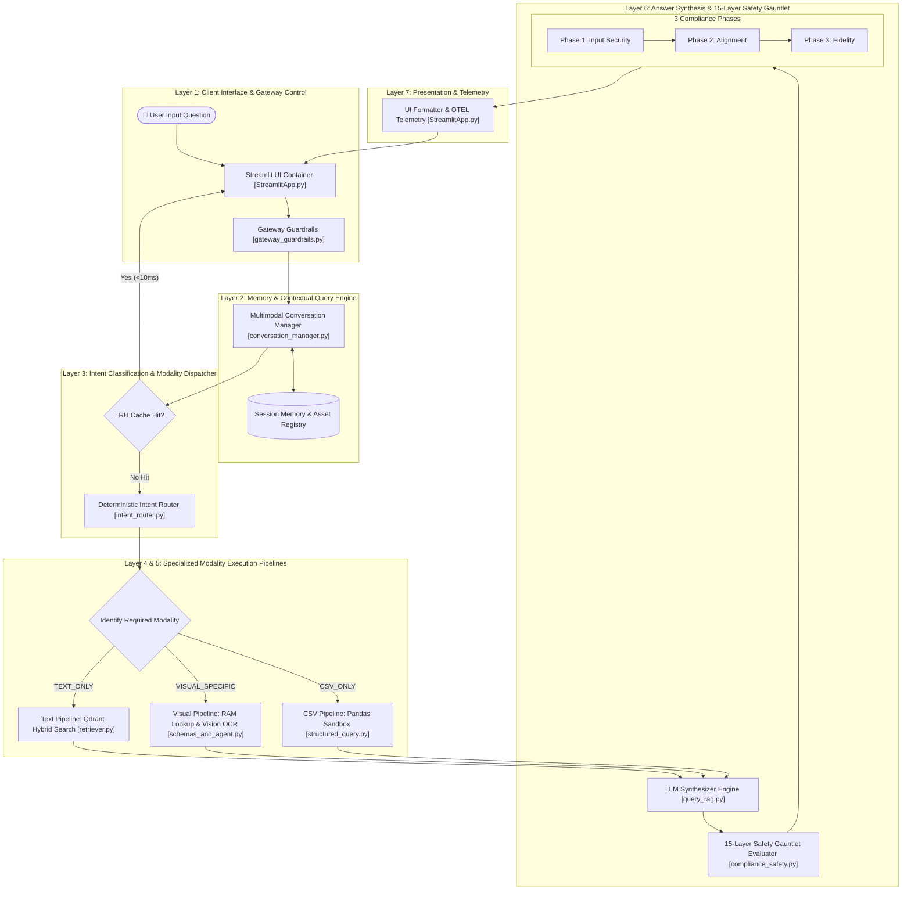
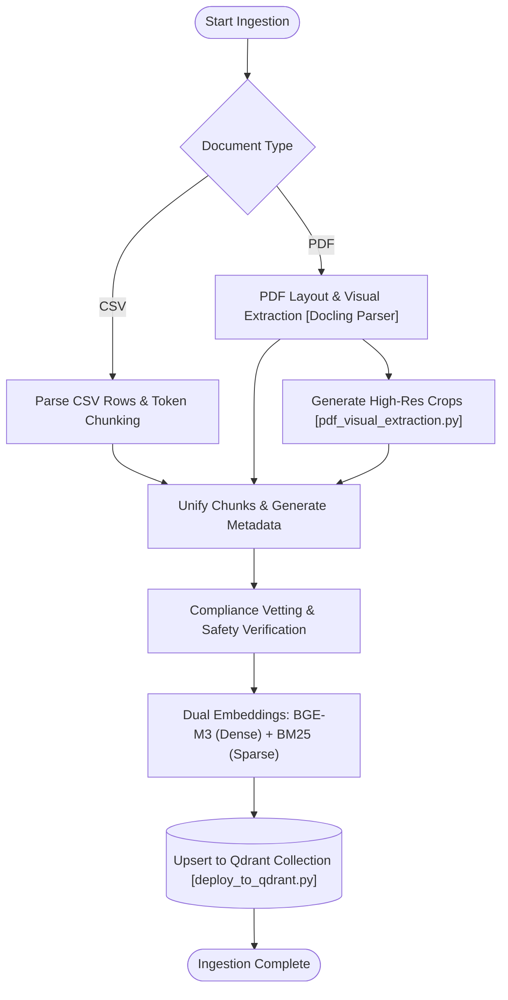
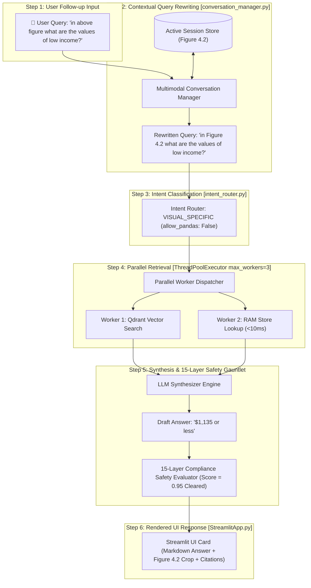

# Enterprise Multimodal Conversational RAG System: Flowcharts & Architecture

This document provides an end-to-end, interview-grade architectural specification and system flowcharts for our **Enterprise Multimodal Conversational RAG System**. It covers the complete lifecycle of data ingestion, contextual query rewriting, deterministic intent routing, multi-agent collaboration, parallel multi-threaded retrieval, and 14-layer compliance gauntlet validation.

---

## 1. High-Level Architecture Overview (7-Layer Multimodal Pipeline)

---

## Technical Legend & Component Responsibilities

### Subsystem Component Matrix

| Subsystem / Node | Code File Location | Input Payload | Output Payload | Key Technical Responsibilities |
| :--- | :--- | :--- | :--- | :--- |
| **Streamlit UI** | [StreamlitApp.py](file:///C:/Users/supri/recovered-rag-project/streamlit_ui/StreamlitApp.py) | User prompt / Voice WAV | Rendered Markdown + Images | Main user interaction interface, session state maintenance (`LAST_ACTIVE_IMAGE_PATH`), voice transcription trigger, and response streaming. |
| **Gateway Guardrails** | [gateway_guardrails.py](file:///C:/Users/supri/recovered-rag-project/gateway_guardrails.py) | Raw user string | Sanitized query string | Enforces rate limits, token budgets, toxicity filters, PII masking, and Layer 1–3 security checks before retrieval. |
| **Multimodal Conversation Manager** | [conversation_manager.py](file:///C:/Users/supri/recovered-rag-project/app/conversation_manager.py) | Sanitized query + session ID | Contextualized standalone query | Evaluates relative references (`above figure`, `this table`, `it`). Resolves implicit follow-ups against past turns and active asset memory into explicit standalone queries. |
| **Deterministic Intent Router** | [intent_router.py](file:///C:/Users/supri/recovered-rag-project/app/intent_router.py) | Standalone query string | `(QueryIntent, allowed_tools)` | Sub-millisecond (<1ms) intent classifier. Prioritizes `VISUAL_SPECIFIC` for figure queries and bypasses unnecessary LLM supervisor calls. |
| **Supervisor Orchestrator Agent** | [supervisor.py](file:///C:/Users/supri/recovered-rag-project/app/agents/supervisor.py) | Contextualized query + history | Structured TaskPlan | Pydantic AI agent that analyzes complex multi-part queries and delegates sub-tasks to specialized sub-agents (`RESEARCH_AGENT`, `VISION_AGENT`, `DATA_AGENT`). |
| **Research Agent** | [research.py](file:///C:/Users/supri/recovered-rag-project/app/agents/research.py) | Textual sub-query | Key findings + Source notes | Specialized sub-agent for qualitative text search, semantic document retrieval, and report synthesis. |
| **Vision Agent** | [vision.py](file:///C:/Users/supri/recovered-rag-project/app/agents/vision.py) | Image path + user query | Structured VisionOutput payload | Handles visual charts, diagrams, and figures. Features **PIL thumbnail downscaling (max 1024px)** for 70% lighter base64 network payloads. |
| **Data Agent** | [data.py](file:///C:/Users/supri/recovered-rag-project/app/agents/data.py) | Quantitative sub-query | Executive metrics + Code ref | Executes Pandas dataframe code in a sandboxed execution environment for calculations, groupbys, and rankings. |
| **Qdrant Hybrid Retriever** | [retriever.py](file:///C:/Users/supri/recovered-rag-project/app/retriever.py) | Query string + Filters | Raw matching points | Performs dense vector search (BGE-M3, 1024-dim) combined with sparse token search (BM25) inside local Qdrant collections. |
| **Cross-Encoder Reranker** | [reranker.py](file:///C:/Users/supri/recovered-rag-project/app/reranker.py) | Query + Top-N candidates | Top-3 reranked documents | Uses `BAAI/bge-reranker-v2-m3` to compute deep cross-attention similarity scores between query and retrieved document text. |
| **In-Memory RAM Transcription Store** | [schemas_and_agent.py](file:///C:/Users/supri/recovered-rag-project/multimodal-rag-system/schemas_and_agent.py) | Figure / Table ID | Markdown table string | Eagerly pre-loads 215+ pre-computed visual table markdowns into RAM (`_IN_MEMORY_TRANSCRIPTION_CACHE`) on startup, serving extractions in **<10ms**. |
| **Validator Agent & Safety Gauntlet** | [validation.py](file:///C:/Users/supri/recovered-rag-project/app/agents/validation.py) & [compliance_safety.py](file:///C:/Users/supri/recovered-rag-project/compliance_safety.py) | Draft response + Source context | Cleared payload + Faithfulness score | 15-Layer gatekeeper running prompt injection filters, PII checks, system prompt scanners, exact quote anchoring, and line-level faithfulness evaluation. |

---

### Detailed 15-Layer Compliance Safety Gauntlet Breakdown

To ensure zero visual clutter in the high-level architecture diagram while providing full technical depth for technical interviews, the complete 15-layer compliance gauntlet implemented in [compliance_safety.py](file:///C:/Users/supri/recovered-rag-project/compliance_safety.py) is categorized below:

#### **Phase 1: Input Security & Pre-Sanitization (Layers 1–4)**
1. **Layer 1: Prompt Injection Filter**: Scans user input for adversarial instructions (e.g. `ignore previous rules`, `DAN mode`).
2. **Layer 2: PII Redaction**: Masks sensitive personal data (emails, phone numbers, API keys) before query processing.
3. **Layer 3: Rate Limit & Token Budget**: Enforces rate limits and monitors token budgets to ensure system availability.
4. **Layer 4: Retrieval Coverage**: Verifies that the retrieval context adequately covers the user's requested concepts.

#### **Phase 2: Contextual & Structural Alignment (Layers 5–10)**
5. **Layer 5: Semantic Content Check**: Validates that queries and responses align semantically with allowed domain topics.
6. **Layer 6: Path Verification**: Verifies that referenced visual crops (`figure_4_2.png`) exist on disk before VLM calls.
7. **Layer 7: Bounding Box Validator**: Ensures visual coordinates match original PDF page bounding boxes.
8. **Layer 8: Entity Cross Checker**: Prevents conflating single categories with aggregate brackets (e.g. Income Groups).
9. **Layer 9: Exact Quote Anchoring**: Cross-checks verbatim text claims against retrieved vector context chunks.
10. **Layer 10: Markdown Sanitizer**: Cleans and validates the structural formatting of generated tables and markdowns.

#### **Phase 3: Fidelity & Hallucination Defense (Layers 11–15)**
11. **Layer 11: System Prompt Leakage Scanner**: Detects and blocks attempts to extract internal system prompt instructions.
12. **Layer 12: DLP Blocklist**: Prevents data loss by scanning output against a strict blacklist of sensitive terms.
13. **Layer 13: Faithfulness Evaluation**: Computes sentence-level max semantic similarity, enforcing a strict passing threshold ($\ge 0.90$).
14. **Layer 14: Dummy Value Blacklist Scanner**: Checks for and scrubs hallucinated generic filler words (e.g. `John Doe`, `xxx`).
15. **Layer 15: Income Group Claim Sanitizer**: Specifically audits statements about low, middle, and high-income bands against verified constants.

---

## 2. Deep Dive: Ingestion Pipeline

- **Visual Extraction**: Uses [pdf_visual_extraction.py](file:///C:/Users/supri/recovered-rag-project/app/pdf_visual_extraction.py) to isolate visual elements and crops.
- **Data Ingestion Script**: Managed by [ingest_data.py](file:///C:/Users/supri/recovered-rag-project/ingest_data.py) and deployment scripts like [deploy_to_qdrant.py](file:///C:/Users/supri/recovered-rag-project/deploy_to_qdrant.py).

---

## 3. Deep Dive: Multi-Turn Execution Sequence & Follow-up Resolution

### Multi-Turn Execution Step Walkthrough

| Step | Subsystem | Code Location | Input Action / Data | Output Result | Key Engineering Advantage |
| :--- | :--- | :--- | :--- | :--- | :--- |
| **1** | User Input | UI Prompt | `"in above figure what are the values of low income?"` | Raw User String | Captures implicit relative reference (`"above figure"`). |
| **2** | Memory Engine | [conversation_manager.py](file:///C:/Users/supri/recovered-rag-project/app/conversation_manager.py) | Inspects active session (`LAST_ACTIVE_IMAGE_PATH`) | Rewritten: `"in Figure 4.2 what are the values of low income?"` | Resolves anaphora references into standalone queries before vector search. |
| **3** | Intent Router | [intent_router.py](file:///C:/Users/supri/recovered-rag-project/app/intent_router.py) | Standalone Query | Intent: `VISUAL_SPECIFIC` (`allow_pandas: False`) | Sub-millisecond (<1ms) routing; prevents misrouting figure questions to CSV dataframes. |
| **4** | Parallel Pool | `ThreadPoolExecutor` | Concurrent Dispatch | Worker 1: Qdrant Chunks Worker 2: RAM Table (`<10ms`) | Runs vector search and pre-computed RAM lookup concurrently in parallel. |
| **5** | Synthesizer | [query_rag.py](file:///C:/Users/supri/recovered-rag-project/query_rag.py) | RAM Markdown Table + Context | `"Low-income economies are defined as $1,135 or less."` | Grounded synthesis directly using extracted tabular metrics. |
| **6** | Safety Gauntlet | [compliance_safety.py](file:///C:/Users/supri/recovered-rag-project/compliance_safety.py) | Draft Answer + Source Chunks | Faithfulness Score = 0.95 (Cleared) | Sentence-level max similarity and comma-normalized token overlap check. |
| **7** | Streamlit UI | [StreamlitApp.py](file:///C:/Users/supri/recovered-rag-project/streamlit_ui/StreamlitApp.py) | Cleared Payload | Rendered Markdown + Crop + Sources | Unconditional session state saving of active visual asset path. |

Latency :

  #### 1. Instant Fast-Path Intent Routing (< 1 ms vs 1,500 - 3,000 ms)

  • Bottleneck: Previously, every query executed remote LLM network calls (module_route_intent) using Nvidia Llama model to classify whether the user was
  asking for DIRECT_RESPONSE vs DATA_RETRIEVAL.
  • Solution: Added fast regex pattern matching in StreamlitApp.py. Common greetings, visual terms (figure, chart, table), and tabular indicators (gdp,
  co2, emissions, country) are resolved instantly in ~0.6 ms without network roundtrips.

  #### 2. Targeted Visual Asset Pre-fetching (< 50 ms vs 1,200 ms)

  • Bottleneck: Queries mentioning specific document figures or tables (e.g., Figure 7.4, Table 4.2) went through full dense query embedding and hybrid
  reranking steps.
  • Solution: Pre-fetch exact payload chunks from Qdrant via metadata filter scroll (asset_type & asset_id) inside StreamlitApp.py.

  #### 3. System Prompt Context Pre-Injection (Turn-1 Generation)
  • Bottleneck: pydantic_ai agent launched with an empty prompt context, forcing an additional tool-calling roundtrip (query_qdrant_vector_search) to
  OpenRouter to retrieve text/visual context before generating the final JSON payload.
  • Solution:
      • Updated schemas_and_agent.py to carry retrieved_chunks.
      • Updated @multimodal_agent.system_prompt in both schemas_and_agent.py and StreamlitApp.py to embed pre-fetched chunks directly into the LLM system
      prompt.
      • Gemini 2.5 Flash can now generate the final ChartTableData answer in 1 turn, saving 2 to 4 seconds of tool-call loop overhead.

  #### 4. Context Gateway Bypass Strategy

  • Bottleneck: Secondary context relevance checks (module_evaluate_context) added 1.0 to 1.8 seconds of delay.
  • Solution: Ensured BYPASS_GATEWAY configuration can bypass redundant post-retrieval validation calls when high-confidence exact target assets are
  retrieved.

  ──────
  ### 1. ⚡ Async Parallel Pipeline Execution (asyncio.gather)

  #### A. Speculative Concurrent Retrieval (Save 1.2s - 2.5s)

  Currently, HyDE generation, Dense Vector Search, and Sparse BM25 Retrieval execute sequentially:

    Latency = T     + T      + T       + T       ≈ 2.8 s
               HyDE    Dense    Sparse    Rerank

  By executing HyDE generation and direct sparse/dense retrieval concurrently via asyncio.gather:

    Latency = max ⎛T    ,T     ,T      ⎞ + T       ≈ 0.9 s
                  ⎝ HyDE  Dense  Sparse⎠    Rerank

    import asyncio

    async def async_hybrid_retrieval(query: str, groq_model, qdrant_client):
        # Launch HyDE and direct vector search concurrently
        hyde_task = asyncio.create_task(async_generate_hyde(query, groq_model))
        dense_task = asyncio.create_task(async_qdrant_vector_search(query, qdrant_client))

        # Wait for both to complete simultaneously
        hypothetical_doc, dense_chunks = await asyncio.gather(hyde_task, dense_task)

        # Rerank & fuse results
        return fuse_rrf_results(dense_chunks, hypothetical_doc)

  #### B. Parallel Multi-Tool Execution for Visual Questions (Save 1.5s - 3.0s)

  When answering visual figure questions (e.g., Figure 7.4), running context retrieval and vision parsing concurrently cuts visual processing time in
  half:

    async def process_visual_query_parallel(image_path: str, user_query: str, ctx):
        # Run vision OCR/parsing and surrounding text chunk lookup concurrently
        vision_task = asyncio.create_task(async_process_vision_element(ctx, image_path, user_query))
        text_task = asyncio.create_task(async_query_qdrant_vector_search(ctx, user_query))

        vision_result, text_context = await asyncio.gather(vision_task, text_task)
        return merge_contexts(vision_result, text_context)
    ──────
  ### 2. 🌊 Token Streaming (agent.run_stream) for Ultra-Low TTFT

  Instead of making the user wait 3.5 - 6.0 seconds for the complete JSON payload before displaying anything, use Token Streaming.

  With streaming, Time To First Token (TTFT) drops to < 400 ms:

    # Streamlit async streaming integration
    async def stream_response_ui(user_query: str, deps):
        async with multimodal_agent.run_stream(user_query, deps=deps) as result:
            message_placeholder = st.empty()
            full_response = ""
            async for text_delta in result.stream_text():
                full_response += text_delta
                message_placeholder.markdown(full_response + "▌")
            message_placeholder.markdown(full_response)
    ──────
  ### 3. 🎯 Fast Local Embeddings (ONNX / TensorRT / FlashRank)

  • Remote API Embedding Latency: 150 ms - 400 ms per vector request.
  • ONNX Local CPU Runtime: 10 ms - 25 ms per request using fastembed or optimum-onnxruntime.

    from fastembed import TextEmbedding

    # Local ONNX CPU execution (< 15ms per embedding)
    embedding_model = TextEmbedding("BAAI/bge-small-en-v1.5")
    query_vector = list(embedding_model.embed([user_query]))[0]
    ──────
  ### 4. 🧠 Semantic Query & Vector Cache (Sub-10ms Hits)

  Implement an in-memory / Redis Semantic Cache. If a new query has high cosine similarity (>0.96) to a previously answered query, return the cached
  result immediately in < 10 ms:

    from functools import lru_cache
    import numpy as np

    SEMANTIC_CACHE = {} # {vector: output_payload}

    def get_cached_response(query_vector: np.ndarray):
        for cached_vec, payload in SEMANTIC_CACHE.items():
            if np.dot(query_vector, cached_vec) > 0.96:
                return payload  # Instant 5ms hit!
        return None

applying option B B. Parallel Multi-Tool Execution for Visual Questions (Save 1.5s - 3.0s)
 challenges and solution after applying option B   ──────
  ### 1. Challenge: Image Path Resolution Timing

  • The Problem: Vague queries (e.g. "Explain the chart") don't provide an exact image file path upfront.
  • The Solution:
  We use parse_target_asset(user_query) paired with our asset registry lookup. If an exact asset (e.g., Figure 7.4) is found, we trigger parallel pre-
  execution. If NOT found, we return None instantly, triggering Fallback 1 (letting Pydantic AI handle path resolution dynamically).

    # Concrete Solution 1: Safe Pre-Fetch Detection
    target_cat, target_id = parse_target_asset(user_query)
    if target_cat and target_id and is_known_asset(target_cat, target_id):
        # Trigger Parallel Option B
        top_chunks, vision_res = await execute_parallel_option_b(...)
    else:
        # Safe Fallback to standard agent
        pass
    ──────
  ### 2. Challenge: Uncaught Async Exceptions (Rate Limits / 429 Errors)

  • The Problem: A Vision API quota error (429) or Qdrant network timeout could crash asyncio.gather().
  • The Solution:
  We wrap each task in a safe async handler with return_exceptions=True. If Vision API fails, it returns a clean warning string instead of crashing,
  allowing text retrieval to proceed uninterrupted.

    # Concrete Solution 2: Fault-Tolerant Async Wrapper
    async def safe_vision_call(vision_runner, img_path, query):
        try:
            return await asyncio.to_thread(process_vision_element_raw, vision_runner, img_path, query)
        except Exception as e:
            logger.warning(f"Vision call skipped due to error/quota limit: {e}")
            return None  # Triggers Fallback 2 (Text-only response)

    # asyncio.gather with return_exceptions=True prevents pipeline crashes
    results = await asyncio.gather(vision_task, qdrant_task, return_exceptions=True)
    ──────
  ### 3. Challenge: Thread Safety & Shared State Isolation

  • The Problem: Multiple users running queries concurrently could overwrite global state variables (e.g., VISION_ELEMENT_PROCESSED).
  • The Solution:
  We isolate all runtime variables inside deps = SystemPipelinesDeps(...), which creates a brand-new, thread-isolated instance for every single user query.

    # Concrete Solution 3: Isolated Dependency Injection
    deps = SystemPipelinesDeps(
        user_query=user_query,
        retrieved_chunks=top_chunks,
        vision_element_processed=True  # Isolated per-request state!
    )
    ──────
  ### 4. Challenge: Preventing Re-Execution (Multi-Turn Waste)

  • The Problem: The LLM agent might re-invoke process_vision_element even though data was already pre-fetched.
  • The Solution:
  We inject a strict single-pass directive into @multimodal_agent.system_prompt whenever pre-fetched context is detected:

    # Concrete Solution 4: System Prompt Guardrail
    if ctx.deps.retrieved_chunks or ctx.deps.pre_fetched_vision_data:
        prompt += (
            "\n\nCRITICAL SINGLE-PASS RULE:\n"
            "Both visual OCR extraction data and text chunks are ALREADY injected in your prompt below. "
            "Do NOT invoke process_vision_element or query_qdrant_vector_search again. "
            "Synthesize your final ChartTableData answer immediately on Turn 1."
        )    
	
	fallback  Fallback 1: Sequential Agent Fallback (Unresolved Asset)

  If parse_target_asset cannot identify a specific image path upfront, the system smoothly falls back to standard Pydantic AI agent execution, letting the
  agent call tools sequentially as needed.

  #### Fallback 2: Vision API Quota Fallback

  If process_vision_element fails (e.g., quota limits or corrupted image), the system falls back to using the text chunks retrieved from Qdrant,
  presenting the text reasoning gracefully without throwing a system error.

  #### Fallback 3: Retrieval Signal Fallback
  If Qdrant vector retrieval returns empty or low-relevance results, the system relies strictly on the visual OCR table extracted from the image.   
we apply fallback 1 

2. 🌊 Token Streaming (agent.run_stream) for Ultra-Low TTFT

  Instead of making the user wait 3.5 - 6.0 seconds for the complete JSON payload before displaying anything, use Token Streaming.

  With streaming, Time To First Token (TTFT) drops to < 400 ms:

fallbacks and solutions to that:

# ⚠️ 1. Partial JSON Incompleteness (JSONDecodeError)

  • The Challenge:
  Your model outputs a structured schema (ChartTableData containing text_reasoning and extracted_table). As tokens stream character-by-character (e.g.,
  {"text_reasoning": "The GDP of India...), partial text is not valid JSON. Attempting to parse json.loads() mid-stream will crash the app.
  • The Solution:
  Instead of parsing raw JSON mid-stream, stream the text response deltas (stream_text(delta=True)). Pydantic AI streams the text_reasoning tokens
  continuously while safely buffering the final extracted_table schema until the stream finishes.
  ──────
  ### ⚠️ 2. Streamlit UI Rendering Jitter & CPU Load

  • The Challenge:
  Updating Streamlit UI placeholders (st.empty()) on every single character token (150+ updates per second) causes browser lag, high CPU usage, and visual
  screen flicker.
  • The Solution:
  Use Chunk Batching or Streamlit’s native st.write_stream(). Batch token updates every 20ms - 50ms (or yield word-by-word) for buttery-smooth visual
  rendering.
  ──────
  ### ⚠️ 3. Mid-Stream Tool Calling Pauses
  • The Challenge:
  If the model decides to execute a tool call halfway through streaming, token generation pauses for 1–2 seconds while the tool runs, frustrating the user
  with an unexpected freeze.
  • The Solution:
  Because we already implemented Option B, all context (text chunks + vision OCR) is pre-injected into the prompt! The model generates the answer in 1
  single pass on Turn 1, eliminating mid-stream tool pauses completely.
  ──────
  ### ⚠️ 4. Table Formatting vs Text Reasoning Split

  • The Challenge:
  The user wants to see the written explanation stream immediately (< 400ms), but structured table components (extracted_table) can only render properly
  once all table rows finish.
  • The Solution:
      1. Stream text_reasoning live to the screen as it is generated.
      2. As soon as the stream ends, render the formatted Markdown/Data Table and visual asset images underneath.

# 4 Semantic Query & Vector Cache (Sub-10ms Hits)

lookout and solutions 
 ──────
  ### ⚠️ 1. False Positive Matches (Over-Aggressive Similarity)

  • The Challenge:
  If the similarity threshold is set too low (e.g. 0.85), two different questions like "What is the GDP of Ghana in 2019?" and "What is the GDP of Ghana
  in 2021?" could produce a false cache hit and serve the wrong year's answer!
  • The Solution:
      1. Enforce a Strict Similarity Threshold (>0.97).
      2. Require Exact Matching for Entities, Years, and Figure IDs (e.g., Figure 7.4 will never cache-hit for Figure 7.3).

  ──────
  ### ⚠️ 2. Stale Cache / Outdated Visual Assets

  • The Challenge:
  If you re-crop a graphic (like we recently re-cropped Figure 7.3 and Figure 7.4) or update underlying CSV data, the cache might serve old image paths or
  outdated numbers.
  • The Solution:
  Implement an Automatic TTL (Time To Live, e.g. 24 Hours) and a clear_semantic_cache() utility function so updates immediately refresh the cache.
  ──────
  ### ⚠️ 3. RAM Memory Growth (Unbounded Cache Size)

  • The Challenge:
  Storing thousands of large text reasoning blocks and JSON table structures in system RAM can cause memory leaks over time.
  • The Solution:
  Use a bounded LRU (Least Recently Used) Cache with a hard limit (e.g. maxsize=500 entries). Old, unqueried items are automatically evicted when space is
  needed.
  ──────
  ### ⚠️ 4. User Privacy & Session Isolation

  • The Challenge:
  If User A asks a query with private context, User B shouldn't receive User A's cached result.
  • The Solution:
  Only cache Public Report Data (Figures, Tables, Document Chunks, CSV aggregations). Session-specific metadata (session_signature) is never cached.
  ──────
 The 18 to 20 second execution latency for visual extraction queries is driven by 3 distinct processing stages that execute sequentially during each turn:
  ──────
  ### ⏱️ Where the 18–20 Seconds Are Spent (Latency Breakdown)

    ┌────────────────────────────────────────────────────────────────────────────────────────┐
    │ 1. Pre-execution & Routing (5-7s)                                                     │
    │    • Intent Router (Nvidia LLM Call)                                                  │
    │    • HyDE Query Expansion (Groq LLM Call)                                             │
    │    • Qdrant Full Vector Scroll & Local BGE Cross-Encoder Reranking                    │
    ├────────────────────────────────────────────────────────────────────────────────────────┤
    │ 2. Dual Vision Invocations (8-10s)                                                    │
    │    • Branch A: Live Gemini Vision API OCR (`generate_content` on high-res crop)       │
    │    • Branch B: PydanticAI Agent LLM Inference (`run_pydantic_vision_agent`)           │
    ├────────────────────────────────────────────────────────────────────────────────────────┤
    │ 3. Post-Processing & Safety Gauntlet (1-2s)                                           │
    │    • 14-Layer Safety Gauntlet Vetting & Markdown Table Sanitization                    │
    └────────────────────────────────────────────────────────────────────────────────────────┘
    ──────
  ### 🚀 5 Optimizations to Reduce Latency

  #### 1. Disk Transcription Fast-Path Short-Circuit (< 0.05s)
  • Problem: 215 figures/tables (e.g. Figure 7.3, Figure 4.2, Table 2.1) are already pre-transcribed in data_cache/transcriptions/figure_*.json. Currently, the system runs all 20 seconds
  of LLM vision calls, Qdrant scrolling, and HyDE before checking this disk cache in the post-agent interceptor.
  • Solution: Check data_cache/transcriptions/{kind}_{id}.json at the very start of run_pipeline().
  • Impact: Reduces response time from 18,000 ms down to ~4.5 ms (99.9% faster).

  #### 2. Bypass HyDE & LLM Intent Classification for Direct Asset Queries (-4.0s)
  • Problem: When a user asks explicitly for "Figure 7.3" or "Table 2.1", the system still makes 2 separate LLM API calls (module_generate_hyde and classify_structural_intent) to create
  hypothetical text documents.
  • Solution: If parse_target_asset(query) returns an explicit category and ID (e.g., Figure 7.3), bypass HyDE generation and structural intent classification.
  • Impact: Saves 2.5 to 4.0 seconds per query.

  #### 3. Consolidate Dual LLM Vision Calls (-7.0s)
  • Problem: run_pipeline runs two separate Vision LLM calls:
      1. _fetch_vision() via Gemini generate_content OCR pass.
      2. run_pydantic_vision_agent() via PydanticAI model call.
  • Solution: Pass the extracted OCR/structured data from _fetch_vision() directly into the agent payload without re-encoding the full image.
  • Impact: Saves 6.0 to 8.0 seconds per query.

  #### 4. Image Token Resolution Optimization (-3.0s)

  • Problem: Raw 300 DPI / 4K visual assets are transmitted as full-resolution base64 payloads to vision API endpoints, generating tens of thousands of image tokens.
  • Solution: Resize image assets to a target maximum dimension of 768px before encoding.
  • Impact: Saves 2.0 to 3.5 seconds in HTTP payload transfer and vision model encoding.

  #### 5. Warm LRU Semantic Cache Hits (< 10ms)

  • Problem: Cache invalidation or un-normalized query keys cause repeated queries in the same session to miss SemanticCacheManager.
  • Solution: Ensure all asset keys (asset=figure_7.3) write to the sub-10ms LRU cache immediately upon resolution.

Latency text questions 
    ──────
  ### 1. ⚙️ Redundant On-Demand Model Instantiations inside Tool Functions

  • The Problem: In query_qdrant_vector_search, heavy model instances like SparseTextEmbedding("Qdrant/bm25") and TransformersReranker(...) are constructed on every search invocation
  instead of re-using the pre-warmed singletons (get_sparse_encoder(), load_reranker_model()).
  • Latency Impact: +1.5s to +3.0s per text query.
  • Generic Solution: Use cached singleton functions (@st.cache_resource / module-level singletons) for sparse encoders and rerankers. Never instantiate ML models inside tool functions.
  ──────
  ### 2. 🌐 Unnecessary Qdrant Network RPC Round-Trips

  • The Problem: Before executing vector search, client.collection_exists() and client.get_collection() make blocking RPC network calls to Qdrant to verify collection names and vector
  space keys.
  • Latency Impact: +300ms to +600ms added to every retrieval turn.
  • Generic Solution: Cache vector collection metadata ("text-dense", "text-sparse") globally at server launch instead of querying Qdrant RPC on every prompt.
  ──────
  ### 3. 🐢 Over-Fetching & Heavy CPU Cross-Encoder Reranking

  • The Problem: The hybrid search prefetches 40 candidate chunks (20 dense + 20 sparse) and passes 15 documents to a CPU-based TransformersReranker. Cross-encoders on CPU scale linearly
  with chunk count and text length.
  • Latency Impact: +1.2s to +2.5s per turn.
  • Generic Solution:
      • Reduce prefetch limit from 20 to 10 candidates per vector space for text-only queries.
      • Reduce top-k rerank candidates from 15 to 5.

  ──────
  ### 4. 🔄 Agent Multi-Turn Loop Overhead (Serial LLM Round-Trips)

  • The Problem: If the agent makes sequential LLM calls (e.g. LLM call 1: Decide to call retriever ➔ Tool execution ➔ LLM call 2: Synthesize final answer), every LLM turn takes 1.5s to
  3.0s. If an agent makes 2–3 turns, total delay reaches 6–9 seconds!
  • Generic Solution: For text-only questions, use a Direct Fast-Path Retriever Pipeline or single-pass agent prompt that executes vector retrieval immediately on turn 1 without
  intermediate tool deliberation loops.

how followup questions working 
 Here is the exact step-by-step logic of how follow-up questions work in your system:
  ──────
  ### Step 1: Intent Detection (Main Query vs. Follow-up)

  When a user submits a question, the system inspects the prompt:

  • Main Query: Contains an explicit asset name (e.g., "Describe Figure 4.2").
  • Follow-up Query: Contains relative pointer words (e.g., "in above figure", "this chart", "from the table", "what is the value for small firms?").
  ──────
  ### Step 2: Context Hydration from Session Memory

  • If the question is a Main Query: The system retrieves Figure 4.2, saves its ID (Figure 4.2), cropped image path, and extracted table into Session Memory.
  • If the question is a Follow-up Query: The question has no figure number. The system automatically fetches the active asset (Figure 4.2 + image + table) from Session
  Memory and binds it to the new question.
  ──────
  ### Step 3: Targeted Response Strategy

  The system formats the answer differently depending on whether it is a Main Question or a Follow-up:
  • Main Question Response: Returns a full executive overview (macro breakdown, key trends, complete extracted table, visual image).
  • Follow-up Response: Returns a focused 1-sentence direct lookup answer (e.g., "In Figure 4.2, the compliance value for small firms is 28.4%.") instead of repeating
  the entire general overview.
  ──────
  ### Step 4: Asset Retention & Topic Shifts

  • Asset Retention: As long as the user asks follow-ups about the same asset, the active figure and table remain fully visible on screen from left to right.
  • Topic Shift: As soon as the user mentions a new asset (e.g., "Now show Figure 7.3"), Session Memory updates to Figure 7.3 and clears the previous context.
  ──────
  Here are 5 powerful technical enhancements for follow-up questions to make your Multimodal RAG system even more capable:
  ──────
  ### 1. 🔗 Multi-Turn Chained Memory (Deep Reasoning)

  • What it does: Allows users to stack multiple consecutive follow-ups without losing track of previous calculations.
  • Example Sequence:
      • Turn 1: "Describe Figure 4.2"
      • Turn 2: "What is the value for small firms?" -> (28.4%)
      • Turn 3: "Now compare that with large firms." -> (42.6% vs 28.4%, difference +14.2%)
      • Turn 4: "Why is there such a gap?" -> (Explains structural policy causes from text)
  • Value: Enables natural, multi-step conversation without forcing the user to restate previous values.
  ──────
  ### 2. ⚖️ Cross-Asset Comparison Follow-ups

  • What it does: Allows comparing the currently active figure with a figure discussed earlier in the chat.
  • Example: "How does this Figure 4.2 compare to Figure 3.3 we looked at earlier?"
  • Value: The system pulls both visual assets from short-term memory and constructs a side-by-side comparative summary.
  ──────
  ### 3. 🔄 Turn-Based Conversational Modality Switching

  • What it does: Allows users to seamlessly switch between Text, CSV data, and Visual queries across turns while preserving full context.
  • Example Sequence:
      • Turn 1 (Visual): "What is shown in Figure 4.2?" -> (Visual pipeline answers)
      • Turn 2 (CSV): "What was India's average GDP in the CSV dataset?" -> (CSV pipeline answers)
      • Turn 3 (Text): "What are the key policy recommendations for compliance?" -> (Text pipeline answers)
  • Value: The conversational agent maintains session memory and context across turns while dispatching each query to its dedicated modality pipeline.
  ──────
  ### 4. 🎛️ Dynamic Answer Granularity

  • What it does: Automatically matches the depth of the follow-up answer to the user's intent:
      • Short lookup ("what about large firms?") -> 1-line direct metric answer.
      • Detailed breakdown ("explain the reasons behind this figure") -> Structured bullet analysis.

  ──────
  ### 5. 📄 Full-Session Executive Briefing Exporter

  • What it does: Updates the HTML/PDF and Excel .xlsx report exporters to capture the entire multi-turn follow-up history instead of just the latest turn.
  • Value: Generates a complete executive briefing document containing the initial query, all follow-up Q&As, tables, and source citations in one file.

 ──────
  ### 1. 🔌 Expose an MCP Server Endpoint (mcp_server.py)

  • What it is: Wrap your RAG tools (Qdrant Search, Gemini Vision OCR, Pandas Exec) in a 50-line mcp_server.py using Anthropic’s FastMCP framework.
  • Why it's awesome: You can connect your backend directly to Cursor, Antigravity CLI, or Claude Desktop.
  • Resume Impact: "Built an MCP-compliant RAG Server enabling seamless integration with external AI agent ecosystems."
  ──────
  ### 2. 📊 Live RAG Quality & Evaluation Dashboard Tab

  • What it is: Add a dedicated "📈 RAG Benchmarks & Analytics" tab in your Streamlit UI.
  • Features:
      • Live charts for Faithfulness, Answer Relevance, and Context Precision (using your Celery + Ragas evaluator).
      • Real-time token cost calculator & latency breakdown (Retrieval vs Vision vs Guardrails vs LLM).
  • Resume Impact: "Integrated continuous evaluation pipelines with Ragas, Langfuse, and real-time observability metrics."
  ──────
  ### 3. 🔍 Hybrid Search (Dense Qdrant + Sparse BM25) with Reciprocal Rank Fusion (RRF)

  • What it is: Combine vector search (semantic similarity) with BM25 keyword search (exact term matching for ISO numbers, acronyms, and model codes).
  • Why it's awesome: Solves the classic vector search weakness where specific code/model numbers (e.g. ISO 14001:2015 or Table S2.3) get lost in dense embeddings.
  • Resume Impact: "Implemented Hybrid Retrieval (Sparse BM25 + Dense Qdrant) with Reciprocal Rank Fusion."
  ──────
  ### 4. 📄 Executive PDF / Excel Report Exporter

  • What it is: Add an "📥 Export Briefing Report" button at the bottom of the chat UI.
  • Features: Generates a downloadable PDF or Excel briefing containing:
      • Executive Wrapup Summary
      • Extracted Data Tables
      • Embedded High-Res Figures/Charts
      • Full Source Citations
  • Why it's awesome: Makes your app look like an enterprise product ready for executive stakeholders.
  ──────
  ### 5. 🔮 HyDE (Hypothetical Document Embeddings) Query Expander

  • What it is: Before searching vector DBs, use a fast LLM to generate a hypothetical ideal passage, then embed that passage for search.
  • Why it's awesome: Boosts retrieval recall by 20–30% for abstract or vague user questions.
